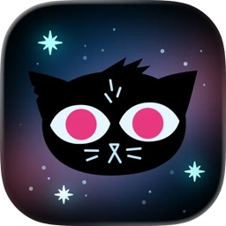
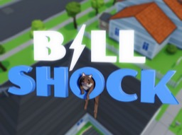
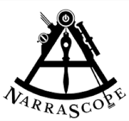

Paris is a computer scientist, game designer, writer, and artist, based in Hobart, Tasmania. He's also doing a law degree, because apparently he didn't have enough on.

He co-founded [Secret Lab](https://secretlab.games) — the studio behind the beloved ABC Play School games, best known for working on the BAFTA-winning [Night in the Woods](https://nightinthewoods.com) and creating [Yarn Spinner](https://yarnspinner.dev), the narrative tools that power *DREDGE*, *A Short Hike*, *Little Kitty Big City*, and thousands more games. He's written [over 20 books](/books-and-events/books) for O'Reilly and Wiley, talks about [space on ABC Radio](/tags/space-news/), occasionally teaches at the University of Tasmania, and has a PhD in Computing and a degree in medieval history (which is more useful than it sounds).

When not doing any of that, he helps run [Tasmanian Game Makers](https://tasgamemakers.com) (as President), helps run [/dev/world](https://devworld.com.au) (the longest-running Apple developer conference not run by Apple), and co-founded a [space centre](https://westcoastspacecentre.com) with his [wife](https://themartianlife.com). He lives in Hobart with said wife and serves as butler to three chihuahuas and a whippet.

<nav class="about-jump-nav">
<a class="about-jump-link" href="#products">Products</a>
<a class="about-jump-link" href="#books">Books</a>
<a class="about-jump-link" href="#work">Work</a>
<a class="about-jump-link" href="#events">Events</a>
<a class="about-jump-link" href="#community">Community</a>
<a class="about-jump-link" href="#skills">Skills</a>
<a class="about-jump-link" href="#education">Education</a>
<a class="about-jump-link" href="#awards">Awards</a>
<a class="about-jump-link about-jump-link--more" href="/bio/">More detailed info →</a>
</nav>

<section class="projects-section">
<h2 class="projects-section-title" id="products">Products &amp; Projects</h2>

Yarn Spinner

<a href="https://www.yarnspinner.dev/" style="color:inherit;text-decoration:none">Yarn Spinner</a>

The industry-standard narrative tool for games. Powers DREDGE, Venba, A Short Hike, Little Kitty Big City, NORCO, Luma Island, and thousands more.

Producing Software Engineering

Products:
Yarn Spinner for Unity
Yarn Spinner for Godot
Yarn Spinner for Unreal
VS Code Extension
Try Yarn Spinner
Core Compiler
Yarn Spinner Playground
Story Solver
+ more

Awards:
<a class="project-award" href="#awards">Minister's STEM Innovation 2025</a>
<a class="project-award" href="#awards">TasICT 2017</a>

<a class="project-card-link project-card-link--full" href="https://www.yarnspinner.dev/blog/hint-line-93/">

Secret Lab &amp; Yarn Spinner

Hint Line '93

A retro video game hint line experience, featured at ACMI.

Producing Software Engineering Writing Game Design

</a>

<a class="project-card-link project-card-link--full" href="https://store.steampowered.com/app/2150850/I_Feel_Fine/">

<video class="iff-hover-video" src="/images/iff-hover.mp4" muted loop playsinline preload="none"></video>

Secret Lab

I Feel Fine

A narrative adventure game about the end of the world, written by Eisner-winner Ryan North, built with Yarn Spinner. Funded by Screen Tasmania.

Producing Software Engineering

</a>

Secret Lab

Leonardo's Moon Ship

An adventure game about helping Leonardo da Vinci reach the moon. Character and world created by <a href="https://en.wikipedia.org/wiki/Jim_Capobianco">Jim Capobianco</a>, powered by Yarn Spinner, and partially funded by Screen Tasmania and Screen Australia.

Producing Software Engineering Writing Game Design

<canvas class="mtpleasant-starfield"></canvas>

Secret Lab

Mt Pleasant

Early, early pre-production for a workplace TV sitcom set at a radio observatory in rural Tasmania.

Writer Creator

<a class="project-card-link project-card-link--full" href="https://theunconformity.com.au/explorations/moonland-rover-lab/">

The Unconformity

Moonland Rover Lab

An exploration for The Unconformity.

Software Engineering Writing Education Game Design

</a>

Secret Lab

Night in the Woods

BAFTA- and IGF-winning adventure game about a college dropout returning to her crumbling hometown. Praised for its writing, art, and unflinching look at small-town life. We created Yarn Spinner for Night in the Woods.

Producing Software Engineering

Awards:
<a class="project-award" href="#awards">BAFTA 2018</a>
<a class="project-award" href="#awards">IGF 2018</a>

<a class="project-card-link project-card-link--full project-card-wrap--culture" href="https://web.archive.org/web/20080724122546/http://secretlab.com.au/culture/">

<canvas class="culture-canvas"></canvas>

Secret Lab

Culture

One of the first games on the iOS (then iPhone) App Store, all the way back in 2008.

Producing Software Engineering Game Design

</a>

A Well-Known Company

Redacted

A game to teach children important skills built for a major client.

Producing Software Engineering Game Design

Australian Broadcasting Corporation (ABC)

Play School Play Time

Official games for Australia's beloved children's TV show, Play School, for the Australian Broadcasting Corporation.

Producing Software Engineering Game Design

Awards:
<a class="project-award" href="#awards">AIMIA Best of Tablet</a>
<a class="project-award" href="#awards">TasICT 2013</a>

Australian Broadcasting Corporation (ABC)

Play School Art Maker

Creative art-making app for kids, part of the ABC Play School suite.

Producing Software Engineering

Awards:
<a class="project-award" href="#awards">AIMIA Effectiveness</a>
<a class="project-award" href="#awards">AIMIA Best Tablet App</a>
<a class="project-award" href="#awards">AIMIA Best Children's</a>

Qantas

Joey Playbox

Creative children's entertainment for in-flight use on one of the oldest and most respected airlines in the world.

Producing Software Engineering Game Design

Awards:
<a class="project-award" href="#awards">iAward Mobility Innovation 2016</a>

CSIRO

Physical Activity Games

Exploring whether video games can help motivate people's fitness, for Australia's national laboratory.

Producing Software Engineering Game Design

National Museum of Australia

The Museum Game

An interactive experience that has helped thousands of school children explore and engage with the museum's collection.

Producing Software Engineering Game Design

TasNetworks

Bill Shock

A game to help people understand how their appliance use impacts their energy costs.

Producing Software Engineering Game Design

CoRE Learning Foundation

Old as Dirt &amp; Resource, Respond Rescue!

Award-winning party games and custom Minecraft: Education Edition content to teach the next generation of STEM leaders. Minecraft content by <a href="https://themartianlife.com">Mars</a>.

Producing Software Engineering Game Design

Australian Government

National Science Week Apps

The official <a href="https://www.scienceweek.net.au/">National Science Week</a> apps for Australia, built for many years running. Most recent versions by <a href="https://themartianlife.com">Mars</a>.

Producing Software Engineering

Port Arthur Historic Site

Guide App

Visitor guide app for one of Australia's most significant heritage sites.

Producing Software Engineering

Fastmail

iPhone and Android App

Work for the most amazing email provider on the planet.

Producing Software Engineering

Mighty Games Group

Client Projects

Projects for the Australian game development powerhouse.

Producing Software Engineering Game Design

Studyladder

Feed a Frog

An engaging educational game for children, tied into Studyladder's classroom rewards system.

Producing Software Engineering Game Design

Plus hundreds more projects I can't talk about, including work for Google, Apple, a rather <em>marvel</em>lous superhero comics publisher, a beloved cooking app for the ABC, educational games for courseware companies, and hundreds more.

</section>

<section class="books-about-section">
<h2 class="books-about-section-title" id="books">Books</h2>

<a class="books-about-more" href="/books-and-events/books/">All books, translations &amp; fiction →</a>
</section>

<section class="entities-section">
<h2 class="entities-section-title" id="work">Work</h2>

<a href="https://yarnspinner.dev" class="entity-card-main">

Yarn Spinner

Head of Product, Research &amp; Analytics · 2023–present

Narrative game tools used by thousands of games played by millions

</a>

<a class="entity-card-link entity-card-link--full" href="https://secretlab.games">

Secret Lab

Head of Product &amp; Creative · 2008–present

Award-winning game development studio (Night in the Woods)

</a>

<a class="entity-card-link entity-card-link--full" href="https://westcoastspacecentre.com">

West Coast Space Centre

Chair · 2023–present

Not-for-profit STEM engagement initiative

</a>

<a class="entity-card-link entity-card-link--full" href="/tags/space-news/">

ABC

Space News Presenter · 2025–present

Monthly radio segment on space news, ABC Radio Hobart

</a>

<a class="entity-card-link" href="https://utas.edu.au">

University of Tasmania

Sessional Academic · 2008–present

Teaching and research in computing

</a>

<a href="/books-and-events/books/" class="entity-card-main">

O'Reilly Media

Technical Author · 2011–2023

Author of books on mobile dev, AI, game design, and Swift

</a>

<a href="/books-and-events/books/" class="entity-card-main">

Wiley

Technical Author · 2009–2011

For Dummies imprint, including iPhone &amp; iPad Game Dev

</a>

<a class="entity-card-link" href="https://en.wikipedia.org/wiki/Meebo">

Meebo

Product Manager · 2007–2013

Consumer web platform, acquired by Google for $100M

</a>

<a class="entity-card-link" href="https://en.wikipedia.org/wiki/GovHack">

GovHack

Program Manager · 2018

National open-data hackathon competition

</a>

IT

ITHINKITWORKS

Software Engineer · 2001–2007

Software engineering and consulting

</section>

<section class="projects-section">
<h2 class="projects-section-title" id="events">Events</h2>

<a class="project-card-link project-card-link--full" href="https://devworld.au/index.php">

AUC

/dev/world + X World

The longest-running Apple developer conference not run by Apple, since 2008.

</a>

<a class="project-card-link project-card-link--full" href="https://leveluptasmania.com">

Tasmanian Game Makers

Level Up Tasmania

Tasmania's game development conference and showcase.

</a>

<a class="project-card-link project-card-link--full" href="https://narrascope.org/">

IFTF

NarraScope 2026

Interactive narrative and storytelling conference. Part of the Programming Group.

</a>

<a class="project-card-link project-card-link--full" href="https://inspiringtas.org.au/2024/07/west-coast-space-show/">

West Coast Space Centre

West Coast Space Show

A live space show bringing STEM engagement to regional Tasmania.

</a>

And hundreds of events, including corporate training for Apple, Google, Microsoft, and everyone in between, plus regular meetups for Tasmanian Game Makers, Inc., AUC events like XWorld and CreateWorld, and all manner of workshops. <a href="/books-and-events/events/">More on speaking appearances and events.</a>

</section>

<section class="entities-section">
<h2 class="entities-section-title entities-section-title--community" id="community">Community</h2>

<a class="entity-card-link entity-card-link--full" href="https://tasgamemakers.com/">

Tasmanian Game Makers

President · 2019–present

Government advocacy securing policy changes and sector funding

</a>

<a class="entity-card-link entity-card-link--full" href="https://auc.edu.au/">

AUC

Secretary of Executive · 2014–present

Australasian Apple University Consortium, runs /dev/world

</a>

Pearcey Foundation

Committee Member · 2014–present

Recognising contributions to the Australian ICT sector

<a class="entity-card-link" href="https://www.acs.org.au/">

ACS

Executive Committee Member · 2008–2020

Australian Computer Society, Gold Disruptor 2016

</a>

</section>

<section class="skills-section">
<h2 class="skills-section-title" id="skills">Skills</h2>

Technical · Product Strategy · Swift · C# · C++ · C · Rust · Python · React · TypeScript · Vite · Unity · Godot · Unreal Engine · Phaser.js · Game Development · Narrative Systems · Yarn Spinner · Ink · Mobile Dev · Android · Apple Platforms · Machine Learning · AI · Data Science · Language Design

Research &amp; Writing · Qualitative Research · Quantitative Research · AI Governance · Technical Writing · HCI Research · Policy Analysis · Information Management · Public Speaking · Science Communication · Broadcasting · Administrative Law

Leadership · Government Advocacy · Community Building · Board Governance · Stakeholder Engagement · Event Organisation · Funding Strategy · Education · Cross-functional Teams

</section>

<section class="entities-section">
<h2 class="entities-section-title entities-section-title--education" id="education">Education</h2>

University of New England

Bachelor of Laws (LLB) · 2018–present

Understanding how regulation actually works, particularly for AI

Tasmanian Leaders

Graduate TLP12 · 2018

Intensive year-long program developing high-potential leaders

University of Tasmania

PhD, Computer Science · 2009–2012

Managing personal information across multiple platforms

University of Tasmania

BComp (Hons), Computing · First Class Honours

Thesis: See Through Paper — Exploring PIM with RFID

University of Tasmania

BA-BComp, Medieval &amp; Modern History, CS

Double degree in history and computer science

The Hutchins School

Secondary Education

Hobart, Tasmania

</section>

<section class="awards-section">
<h2 class="awards-section-title" id="awards">Awards</h2>

2025

<a href="https://inspiringtas.org.au/2025/11/2025-stem-excellence-awards-winners/">Minister's STEM Innovation of the Year</a>

Yarn Spinner — Yarn Spinner 3 &amp; Story Solver

TasICT

2024

<a href="https://www.utas.edu.au/about/news-and-stories/articles/2024/congratulations-to-our-alumni-award-winners-for-2024">Young Alumni Award</a>

University of Tasmania

2021

Best Customer Service or Solution

Educational Games for CoRE Learning Foundation

TasICT

2018

BAFTA Award, Best Narrative Game

Night in the Woods

BAFTA

2018

Excellence in Narrative

Night in the Woods

Independent Games Festival

2018

Seumas McNally Grand Prize

Night in the Woods

Independent Games Festival

2017

Best Tasmanian Customer Service or Solution (Merit)

Yarn Spinner &amp; Night in the Woods

TasICT

2016

Mobility Innovation of the Year

Joey Playbox for Qantas

iAward

2016

Gold Disruptor

Australian Computer Society

2014

Best of Tablet (overall winner)

Play School Play Time

AIMIA

2014

Best of Tablet – Entertainment

Play School Play Time

AIMIA

2014

Best of Tablet – Learning and Education

Play School Play Time

AIMIA

2014

Best ICT Solution

TasICT

2014

Go South Awards, Business Category

SnapTas

Go South

2013

Effectiveness

Play School Art Maker

AIMIA

2013

Best Application for a Tablet

Play School Art Maker

AIMIA

2013

Best Children's

Play School Art Maker

AIMIA

2013

Best Software Product

Play School Art Maker

TasICT

2012

Best Cultural or Lifestyle

Foodi

AIMIA

2012

Best Application on a Tablet or Mobile

Play School Art Maker

AIMIA

2010

Excellence in Digital Media

TasICT

2010

Export Success

TasICT

2010

President's Award for Excellence

TasICT

2010

Pearcey Award

Pearcey Foundation

</section>

