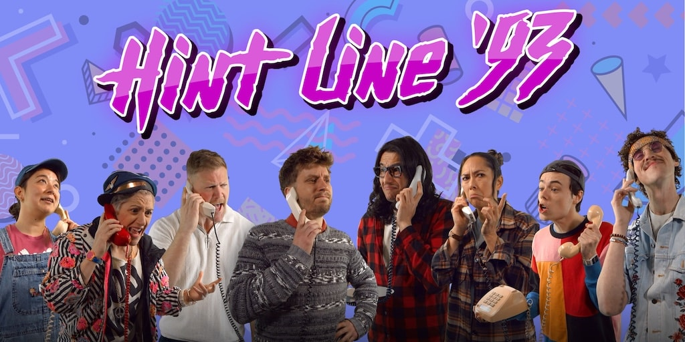

I'm so proud of this.

[Hint Line '93](https://www.acmi.net.au/works/125408--hint-line-93/), a game we made at [Yarn Spinner](https://yarnspinner.dev), is now on display at ACMI's [Game Worlds](https://www.acmi.net.au/whats-on/game-worlds/) exhibition. We put up a [big behind-the-scenes post on the Yarn Spinner blog](https://yarnspinner.dev/blog/hint-line-93), so go read that...

For those who don't know, early last year ACMI (the Australian Centre for the Moving Image, a museum of screen culture in Melbourne) put out a call for commissioned microgames. They wanted playable experiences for a museum context: 5-10 minutes, compelling world-building, accessible to a wide variety of visitors.

We pitched something ridiculous (that I came up with!): a hint line simulator with a 300-page physical binder.

Remember hint lines? 1-900 numbers, long-distance charges, hoping whoever answers actually knows what they're talking about? They had incomplete documentation, contradictory notes, whatever the previous shift scribbled down. But who were those people? The mechanics and infrastructure of their work is largely forgotten.

So we made a game where you work at one. You're a hint line operator for a fictional company called Damocles Interactive, answering calls about their library of obtuse 1993 video games. The solution to problems isn't on screen. It's in a real physical binder on the desk next to you called The Compendium, a dog-eared mess of official docs mixed with handwritten notes from previous operators who figured out what actually works.

ACMI's response to our pitch was basically "this sounds completely impractical and we love it."

We built the whole thing in two months. Jon Manning, Tim Nugent, Mars Buttfield-Addison, Meghann O'Neill, and I made up the development team. I wrote over 100,000 words across the game's dialogue and The Compendium, plus a heap of pixel art for the fictional games. My wife, [Mars](https://themartianlife.com), did an equally absurd amount of art, design, and layout work, and then designed and hand-assembled four complete copies of The Compendium, each one needing to feel genuinely accumulated rather than artificially aged. Decoder wheels, red cellophane for anaglyph decoders, sticky notes in different handwriting styles, hand-corrected maps, corporate memos, fake Usenet posts, the works.

Meghann interviewed Brian Costelloe and Tim Gadler, who actually worked Sega's Australian tip line from 1992 to 1995. Their stories helped take our concept from nostalgia pastiche into something grounded.

The dialogue system uses [Yarn Spinner](https://yarnspinner.dev) (naturally), and we shot photos of real Tasmanian performers for the character portraits, capturing every emotional beat a hint line conversation could hit: confused, frustrated, desperately confused, so confused they might cry.

ACMI built a complete 1990s office environment for the installation, with a vintage cubicle setup, modern hardware hidden inside a beige desktop computer, a CRT monitor, a Newton's cradle desk toy, and a strategically placed dead plant. Perfect corporate wasteland aesthetic.

I'm incredibly proud of what we made. It's both nostalgia tourism and a game about a disappeared form of human connection. Before gaming became fully documented, wikified, and speedrun-optimised, it was weird, experimental, mysterious. Getting help required talking to another human, someone who might be an expert, might be reading from the same manual you have, or might just be good at confident-sounding guesses.

Read the [full behind-the-scenes post on the Yarn Spinner blog](https://yarnspinner.dev/blog/hint-line-93/).

If you're in Melbourne, you can [play it at ACMI](https://www.acmi.net.au/whats-on/game-worlds/) as part of the Game Worlds exhibition, which runs until 29 March 2026. If you can't make it, there's an [online version](https://hintline93.acmi.net.au/) and an [online Compendium](https://compendium.hintline93.com/), but flipping through the physical artifact is genuinely half the fun.
