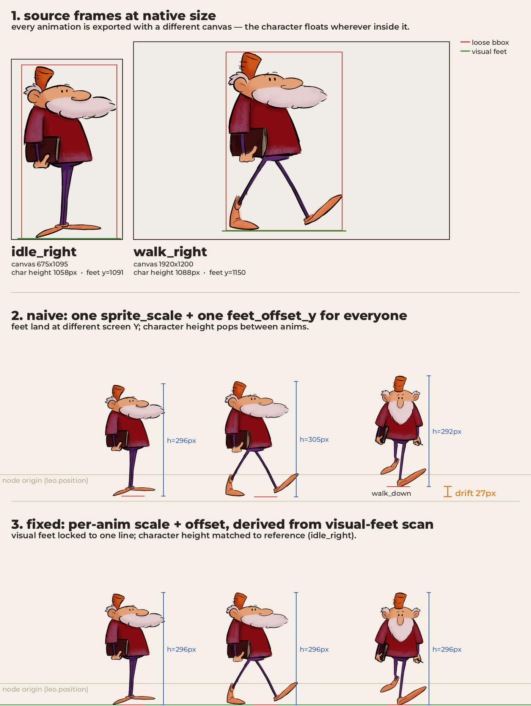

We're working on an adventure game, [Leonardo's Moon Ship](https://yarnspinner.dev/leonardo/). The player character, Leo, has the usual pile of animations: idle left and right, walk in four directions, a couple of stair anims. Since implementing the basics of the character, Leo has had this slightly cursed behaviour where he'd grow about 3% taller the moment he started walking, then shrink back when he stopped. His feet would also lift off the ground by up to 27 pixels depending on which way he was facing. Not enough to be obviously broken in a screenshot. Exactly enough to make the game feel wrong.

<video controls width="720" style="max-width:100%;height:auto;">
  <source src="explain-overlay.mp4" type="video/mp4">
</video>

That's the bug overlaid on itself. The red ghost is the naive setup. The blue is the fixed version. When Leo's idle they sit on top of each other. The second a walk anim kicks in the red drifts up and out of place.

## Why a single scale falls over

The animations came from the artists on wildly inconsistent canvases. Not the character, the canvas the character was painted on. Here's the actual sizes:

- idle_right: 675x1095, character tight-cropped
- idle_left: 616x1094, basically the same character, slightly different crop
- walk_right and walk_left: 1920x1200, but Leo himself is only about 700x1088 and floating somewhere inside all that transparent space
- walk_up: 664x1202
- walk_down: 664x1202

This is normal. Artists work in whatever canvas size makes sense for the motion they're drawing. Walk cycles need horizontal room for the stride, idle frames don't. And good luck enforcing a single canvas size across hundreds of frames and constant revisions.

The naive setup was a single animated-sprite node with one `sprite_scale` of 0.28 and one `feet_offset_y` of -340 applied globally. That only works when every animation has the same character pixel height and the character sits at the same place inside its canvas. Neither was true here. The walk_right character was about 305 visible pixels tall, idle_right was 296. Multiply both by 0.28, and one renders three pixels taller than the other every time Leo stops moving. And because walk_down had Leo floating higher inside his canvas, applying the same offset put his feet 27 pixels above the ground.



Panel one shows the loose alpha bounding box that a stock image library hands you (in red) versus the actual visual feet line (in green). Panel two is what you got with the single global scale and offset: drift everywhere. Panel three is the fix.

Levels in this game are tuned around the convention that Leo's root node sits at his feet, so spawn points and collision shapes just work. That convention was being silently violated every time he changed animation. The collision body was fine. The visuals were lying about where the body actually was.

## The fix: per-anim metrics, computed at load

The first instinct is to crop the bounding box and call it a day. Don't. The stock alpha-bounding-box helper returns a rect containing every pixel with any alpha, which means it catches anti-aliasing halos and baked drop-shadow halos that extend a noticeable distance below the visible feet. Those halos vary per animation because the artist redrew the shadow each time. The loose bbox bottom is not where the feet are.

So at load time, the character script walks every frame of every animation and runs a small scan. For each frame it grabs the loose alpha bbox, then scans rows from the bottom upward looking for the first row where at least 5% of the bbox width has alpha greater than 0.5. That row is the visual feet line. The scan bails the instant it finds an opaque row, so it's basically free even across a few hundred frames.

For each animation I average the visual-feet Y and the character pixel height across every frame, which means the walking bob doesn't bias one frame and ruin the alignment. Then I pick idle_right as the reference, because the levels are already tuned to its feet position and I'm not redoing all that work. For every other animation:

```
anim_scale = sprite_scale * (ref_char_h / this_anim_char_h)
anim_offset_y = ref_feet_local_y - (this_anim_feet_y * anim_scale)
```

That gives every animation a pre-computed scale and offset that makes its rendered character the same pixel height as idle_right and lands its visual feet at the same local Y. Then I hook the animation-change callback and apply the right values whenever the current animation flips.

<video controls width="720" style="max-width:100%;height:auto;">
  <source src="explain.mp4" type="video/mp4">
</video>

Naive on the left, fixed on the right, same animation timeline. The red line on the naive side tracks where the feet actually are frame to frame, which is depressing. The green line on the fixed side is locked, and Leo stays on it.

## The shadow came along for the ride

Leo has a shadow, a separate ellipse sprite parented to him. Originally it was anchored to the node origin, which meant it floated somewhere around his knees and danced about as he changed animation. With the feet now pinned to a known constant Y in Leo's local space, the shadow just sits at that Y. No per-anim shadow logic. It works for the stair animations too, which I didn't even bother testing until a week later because I'd already mentally filed the problem as solved. It was.
